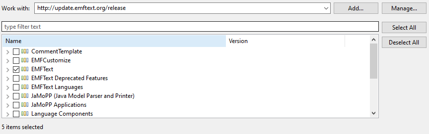
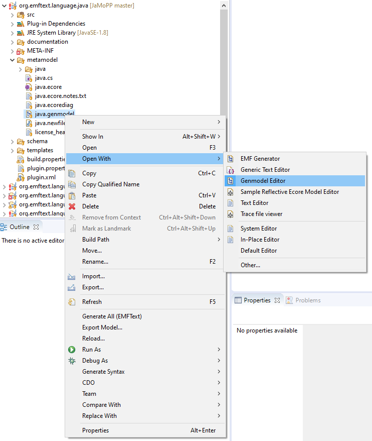
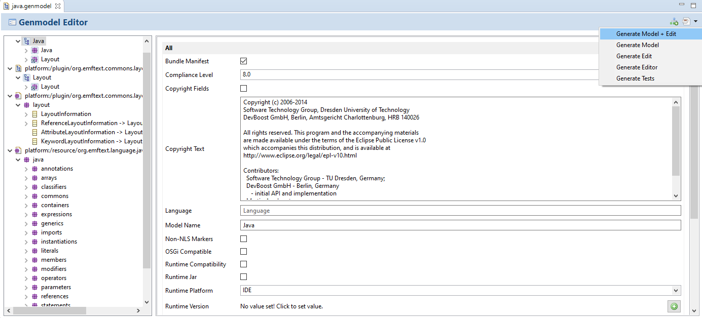
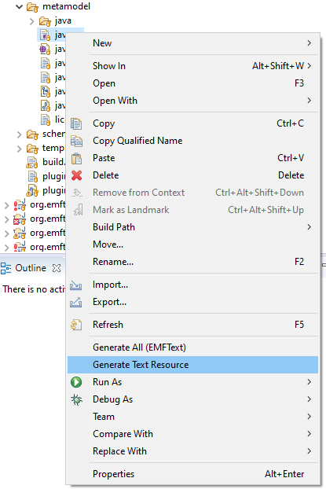
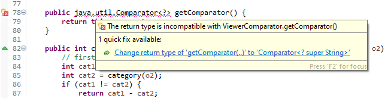
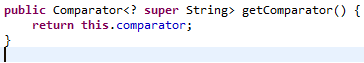

**Notice:** This repository is not endorsed by or affiliated with DevBoost GmbH or Software Technology Group, Dresden University of Technology.

JaMoPP can parse Java source and byte code into EMF-based models and vice versa. It preserves source formatting and can be used for code analysis and refactoring.

# Getting Started

* In Eclipse, after installing JaMoPP, you can load Java files (`.java` and `.class` files) with any [EMF-based](https://www.eclipse.org/modeling/emf/) tool similar to how you load other EMF models.
* For stand-alone usage, use the code in [JaMoPPC.java](https://github.com/HansMartinA/JaMoPP/blob/master/Utils/org.emftext.language.java.jamoppc/src/org/emftext/language/java/jamoppc/JaMoPPC.java) as a starting point.
* A detailed overview of JaMoPP is provided in [this report](Doc/org.emftext.language.java.doc/publications/2009_JaMoPP_The_Java_Model_Parser_and_Printer.pdf).

# Download/Installation

Currently, JaMoPP only supports a direct inclusion of its sources into Eclipse.

1. Use Eclipse Modeling Tools 2019-09 or 2019-12 (no other versions were tested) with Java 8.
2. Install EMFText available at "http://update.emftext.org/release".

3. Clone this repository.
4. Import all existing projects in "JaMoPP/Core/\*", "JaMoPP/Tests/\*", "JaMoPP/Utils/\*", and "JaMoPP/Eclipse-Integration/\*".
5. In "org.emftext.language.java/metamodel/", right-click on "java.genmodel" and choose "Open With - Genmodel Editor".

6. In the opened window, use the icon in the upper right corner to choose "Generate Model + Edit". This automatically generates the model code.

7. Right-click on "org.emftext.language.java/metamodel/java.cs" and choose "Generate Text Resource". This will generate the parser.

8. In "org.emftext.language.java.resource.java.ui/src-gen/org.emftext.language.java.resource.java.ui/JavaOutlinePageTreeViewerComparator.java", correct the compilation error by applying the proposed solution and saving the file afterwards.

9. Now, JaMoPP should be usable.

# Sources on GitHub

[https://github.com/HansMartinA/JaMoPP](https://github.com/HansMartinA/JaMoPP)

Original repository: [https://github.com/DevBoost/JaMoPP](https://github.com/DevBoost/JaMoPP)

# Publications

Florian Heidenreich, Jendrik Johannes, Mirko Seifert, and Christian Wende 
**Closing the Gap between Modelling and Java** 
*In Proc. of 2nd International Conference on Software Language Engineering (SLE’09)*, LNCS. Springer, 2009. 
[[Authors' version (PDF)](Doc/org.emftext.language.java.doc/publications/2009_SLE_JaMoPP.pdf)]
[[Original publication at SpringerLink](http://www.springerlink.com/content/f50585787w605478/)]

Florian Heidenreich, Jendrik Johannes, Mirko Seifert, and Christian Wende 
**Construct to Reconstruct – Reverse Engineering Java Code with JaMoPP** 
*In Proc. of the International Workshop on Reverse Engineering Models from Software Artifacts (R.E.M.’08)*, 2008. 
[[Authors' version (PDF)](Doc/org.emftext.language.java.doc/publications/2009_REM_JaMoPPReverse.pdf)]

Florian Heidenreich, Jendrik Johannes, Jan Reimann, Mirko Seifert, Christian Wende, Christian Werner, Claas Wilke, and Uwe Aßmann 
**Model-driven Modernisation of Java Programs with JaMoPP** 
*In Proc. of First International Workshop on Model-Driven Software Migration (MDSM’11)*, 2011. 
[[Authors' version (PDF)](Doc/org.emftext.language.java.doc/publications/2011_MDSM_JaMoPPModernise.pdf)]
[[Original publication at CEUR Workshop Proceedings](http://ceur-ws.org/Vol-708/)]
